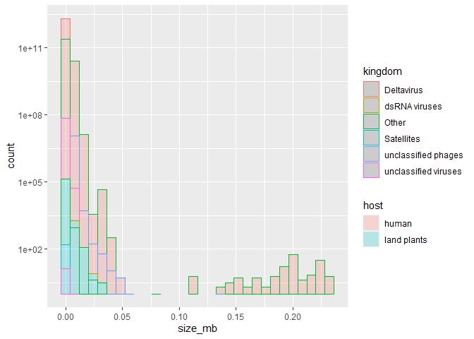

# Hypothesis: Viruses that target land plants will exhibit higher gene load and higher genome lengths than viruses that target humans. 

### Load libraries for tidying

```r
library(tidyverse)
```

```
## -- Attaching packages --------------------------------------- tidyverse 1.3.0 --
```

```
## v ggplot2 3.3.3     v purrr   0.3.4
## v tibble  3.1.0     v dplyr   1.0.4
## v tidyr   1.1.2     v stringr 1.4.0
## v readr   1.4.0     v forcats 0.5.1
```

```
## -- Conflicts ------------------------------------------ tidyverse_conflicts() --
## x dplyr::filter() masks stats::filter()
## x dplyr::lag()    masks stats::lag()
```

```r
library(here)
```

```
## here() starts at C:/Users/starf/Documents/GitHub/Bis15LBuds
```

```r
library(janitor)
```

```
## 
## Attaching package: 'janitor'
```

```
## The following objects are masked from 'package:stats':
## 
##     chisq.test, fisher.test
```

### Load relevant csv


```r
virus<-readr::read_csv("data/viruses.csv")
```

```
## 
## -- Column specification --------------------------------------------------------
## cols(
##   `Organism Name` = col_character(),
##   `Organism Groups` = col_character(),
##   BioSample = col_logical(),
##   BioProject = col_character(),
##   Assembly = col_character(),
##   Level = col_character(),
##   `Size(Mb)` = col_double(),
##   `GC%` = col_double(),
##   Host = col_character(),
##   CDS = col_double(),
##   Neighbors = col_double(),
##   `Release Date` = col_datetime(format = ""),
##   `GenBank FTP` = col_character(),
##   `RefSeq FTP` = col_character(),
##   Genes = col_double(),
##   Scaffolds = col_double()
## )
```

```
## Warning: 344 parsing failures.
##  row       col           expected       actual               file
## 1438 BioSample 1/0/T/F/TRUE/FALSE SAMN02981359 'data/viruses.csv'
## 4401 BioSample 1/0/T/F/TRUE/FALSE SAMN02981224 'data/viruses.csv'
## 8940 BioSample 1/0/T/F/TRUE/FALSE SAMN01137200 'data/viruses.csv'
## 8941 BioSample 1/0/T/F/TRUE/FALSE SAMN01137212 'data/viruses.csv'
## 8944 BioSample 1/0/T/F/TRUE/FALSE SAMN01137140 'data/viruses.csv'
## .... ......... .................. ............ ..................
## See problems(...) for more details.
```

### Inspect


```r
virus
```

```
## # A tibble: 34,747 x 16
##    `Organism Name`     `Organism Groups`    BioSample BioProject Assembly  Level
##    <chr>               <chr>                <lgl>     <chr>      <chr>     <chr>
##  1 White spot syndrom~ Viruses;Other;Nimav~ NA        <NA>       GCA_0008~ Comp~
##  2 Posavirus sp.       Viruses;unclassifie~ NA        <NA>       GCA_0023~ Comp~
##  3 Hepatitis E virus   Viruses;Other;Hepev~ NA        <NA>       GCA_0008~ Comp~
##  4 Heterosigma akashi~ Viruses;Other;Marna~ NA        <NA>       GCA_0008~ Comp~
##  5 Pyrococcus abyssi ~ Viruses;unclassifie~ NA        <NA>       GCA_0008~ Comp~
##  6 Marine RNA virus S~ Viruses;Other;Other  NA        <NA>       GCA_0008~ Comp~
##  7 Tomato marchitez v~ Viruses;Other;Secov~ NA        <NA>       GCA_0008~ Comp~
##  8 Ourmia melon virus  Viruses;Other;Botou~ NA        <NA>       GCA_0008~ Comp~
##  9 Epirus cherry virus Viruses;Other;Botou~ NA        <NA>       GCA_0008~ Comp~
## 10 Vibrio phage dougl~ Viruses;Other;Podov~ NA        PRJNA39215 GCA_0009~ Comp~
## # ... with 34,737 more rows, and 10 more variables: Size(Mb) <dbl>, GC% <dbl>,
## #   Host <chr>, CDS <dbl>, Neighbors <dbl>, Release Date <dttm>,
## #   GenBank FTP <chr>, RefSeq FTP <chr>, Genes <dbl>, Scaffolds <dbl>
```

### Are there any viruses which attack humans AND land plants?

```r
virus$Host<-as.factor(virus$Host)
levels(virus$Host)
```

```
##  [1] "algae"                                            
##  [2] "archaea"                                          
##  [3] "bacteria"                                         
##  [4] "bacteria,fungi,human,invertebrates"               
##  [5] "bacteria,human"                                   
##  [6] "bacteria,human,invertebrates,land plants,protozoa"
##  [7] "bacteria,human,vertebrates"                       
##  [8] "diatom"                                           
##  [9] "eukaryotic algae"                                 
## [10] "eukaryotic algae,human,invertebrates,vertebrates" 
## [11] "fungi"                                            
## [12] "fungi,invertebrates"                              
## [13] "fungi,vertebrates"                                
## [14] "human"                                            
## [15] "human,invertebrates"                              
## [16] "human,invertebrates,vertebrates"                  
## [17] "human,vertebrates"                                
## [18] "invertebrates"                                    
## [19] "invertebrates, vertebrates"                       
## [20] "invertebrates,land plants"                        
## [21] "invertebrates,vertebrates"                        
## [22] "land plants"                                      
## [23] "plants"                                           
## [24] "protozoa"                                         
## [25] "vertebrates"                                      
## [26] "vertebrates, human"
```

### Fix the multiple hosts per host category nonsense.

```r
virus_c<-virus%>%
  separate('Host', into=c("host_type_1", "host_type_2", "host_type_3"), sep=",")
```

```
## Warning: Expected 3 pieces. Additional pieces discarded in 637 rows [1198,
## 10504, 15643, 15930, 16037, 16487, 17027, 17209, 17261, 17262, 17299, 17422,
## 17712, 17811, 17840, 17841, 17867, 17945, 18145, 18215, ...].
```

```
## Warning: Expected 3 pieces. Missing pieces filled with `NA` in 28898 rows [1, 2,
## 3, 5, 7, 8, 9, 10, 11, 12, 13, 14, 15, 16, 17, 18, 19, 20, 21, 22, ...].
```

```r
virus_c
```

```
## # A tibble: 34,747 x 18
##    `Organism Name`     `Organism Groups`    BioSample BioProject Assembly  Level
##    <chr>               <chr>                <lgl>     <chr>      <chr>     <chr>
##  1 White spot syndrom~ Viruses;Other;Nimav~ NA        <NA>       GCA_0008~ Comp~
##  2 Posavirus sp.       Viruses;unclassifie~ NA        <NA>       GCA_0023~ Comp~
##  3 Hepatitis E virus   Viruses;Other;Hepev~ NA        <NA>       GCA_0008~ Comp~
##  4 Heterosigma akashi~ Viruses;Other;Marna~ NA        <NA>       GCA_0008~ Comp~
##  5 Pyrococcus abyssi ~ Viruses;unclassifie~ NA        <NA>       GCA_0008~ Comp~
##  6 Marine RNA virus S~ Viruses;Other;Other  NA        <NA>       GCA_0008~ Comp~
##  7 Tomato marchitez v~ Viruses;Other;Secov~ NA        <NA>       GCA_0008~ Comp~
##  8 Ourmia melon virus  Viruses;Other;Botou~ NA        <NA>       GCA_0008~ Comp~
##  9 Epirus cherry virus Viruses;Other;Botou~ NA        <NA>       GCA_0008~ Comp~
## 10 Vibrio phage dougl~ Viruses;Other;Podov~ NA        PRJNA39215 GCA_0009~ Comp~
## # ... with 34,737 more rows, and 12 more variables: Size(Mb) <dbl>, GC% <dbl>,
## #   host_type_1 <chr>, host_type_2 <chr>, host_type_3 <chr>, CDS <dbl>,
## #   Neighbors <dbl>, Release Date <dttm>, GenBank FTP <chr>, RefSeq FTP <chr>,
## #   Genes <dbl>, Scaffolds <dbl>
```

### Checking my work

```r
virus_c$host_type_1<-as.factor(virus_c$host_type_1)
virus_c$host_type_2<-as.factor(virus_c$host_type_2)
virus_c$host_type_3<-as.factor(virus_c$host_type_3)
levels(virus_c$host_type_1)
```

```
##  [1] "algae"            "archaea"          "bacteria"         "diatom"          
##  [5] "eukaryotic algae" "fungi"            "human"            "invertebrates"   
##  [9] "land plants"      "plants"           "protozoa"         "vertebrates"
```


```r
levels(virus_c$host_type_2)
```

```
## [1] " human"        " vertebrates"  "fungi"         "human"        
## [5] "invertebrates" "land plants"   "vertebrates"
```

```r
levels(virus_c$host_type_3)
```

```
## [1] "human"         "invertebrates" "vertebrates"
```

```r
virus_clong<-virus_c%>%
  pivot_longer(host_type_1:host_type_3,
               names_to="host_num",
               values_to="host_type",
               values_drop_na=T)
virus_clong
```

```
## # A tibble: 42,108 x 17
##    `Organism Name`   `Organism Groups`     BioSample BioProject Assembly   Level
##    <chr>             <chr>                 <lgl>     <chr>      <chr>      <chr>
##  1 White spot syndr~ Viruses;Other;Nimavi~ NA        <NA>       GCA_00084~ Comp~
##  2 Posavirus sp.     Viruses;unclassified~ NA        <NA>       GCA_00237~ Comp~
##  3 Hepatitis E virus Viruses;Other;Hepevi~ NA        <NA>       GCA_00086~ Comp~
##  4 Hepatitis E virus Viruses;Other;Hepevi~ NA        <NA>       GCA_00086~ Comp~
##  5 Pyrococcus abyss~ Viruses;unclassified~ NA        <NA>       GCA_00087~ Comp~
##  6 Tomato marchitez~ Viruses;Other;Secovi~ NA        <NA>       GCA_00087~ Comp~
##  7 Ourmia melon vir~ Viruses;Other;Botour~ NA        <NA>       GCA_00087~ Comp~
##  8 Epirus cherry vi~ Viruses;Other;Botour~ NA        <NA>       GCA_00087~ Comp~
##  9 Vibrio phage dou~ Viruses;Other;Podovi~ NA        PRJNA39215 GCA_00090~ Comp~
## 10 Vibrio phage hel~ Viruses;Other;Myovir~ NA        PRJNA39217 GCA_00090~ Comp~
## # ... with 42,098 more rows, and 11 more variables: Size(Mb) <dbl>, GC% <dbl>,
## #   CDS <dbl>, Neighbors <dbl>, Release Date <dttm>, GenBank FTP <chr>,
## #   RefSeq FTP <chr>, Genes <dbl>, Scaffolds <dbl>, host_num <chr>,
## #   host_type <fct>
```


### Filter for only Complete Genome data, separate Organism Groups into difft columns, reorder, rename


```r
virus_clean<-virus_clong%>%
  separate('Organism Groups', into=c("domain", "kingdom", "subgroup"), sep=";")%>%
  filter(Level=="Complete" & (host_type=="human" | host_type=="land plants"))%>%
  select('host_type', 'Organism Name', 'kingdom','subgroup', 'Size(Mb)', 'GC%', 'Genes','Level')%>%
  rename(organism_name='Organism Name', kingdom=kingdom, subgroup=subgroup, level="Level", size_mb='Size(Mb)', perc_gc='GC%', host=host_type, genes_num='Genes')%>%
  arrange(host)
virus_clean
```

```
## # A tibble: 11,871 x 8
##    host  organism_name      kingdom subgroup    size_mb perc_gc genes_num level 
##    <fct> <chr>              <chr>   <chr>         <dbl>   <dbl>     <dbl> <chr> 
##  1 human Hepatitis E virus  Other   Hepeviridae 0.00718    57.9         3 Compl~
##  2 human Salivirus NG-J1    Other   Picornavir~ 0.00798    56.7         1 Compl~
##  3 human Astrovirus VA1     Other   Astrovirid~ 0.00659    41.9         3 Compl~
##  4 human Pseudocowpox virus Other   Poxviridae  0.145      65         134 Compl~
##  5 human Torque teno mini ~ Other   Anelloviri~ 0.00291    37.8         2 Compl~
##  6 human Torque teno virus~ Other   Anelloviri~ 0.00373    53.4         4 Compl~
##  7 human Torque teno virus~ Other   Anelloviri~ 0.00377    51.2         4 Compl~
##  8 human Torque teno virus~ Other   Anelloviri~ 0.00374    48.4         3 Compl~
##  9 human Torque teno virus~ Other   Anelloviri~ 0.00375    51.4         6 Compl~
## 10 human Torque teno virus~ Other   Anelloviri~ 0.00376    53.8         3 Compl~
## # ... with 11,861 more rows
```

#### Figuring out the limits of the data


```r
virus_clean%>%
  select(size_mb)%>%
  summary()
```

```
##     size_mb        
##  Min.   :0.000248  
##  1st Qu.:0.001768  
##  Median :0.007496  
##  Mean   :0.012225  
##  3rd Qu.:0.017433  
##  Max.   :0.232608
```


```r
virus_clean%>%
  ggplot(aes(x=size_mb, fill=host, color=kingdom))+
  geom_histogram(alpha=0.25)+
  scale_y_log10()
```

```
## `stat_bin()` using `bins = 30`. Pick better value with `binwidth`.
```

```
## Warning: Transformation introduced infinite values in continuous y-axis
```

```
## Warning: Removed 195 rows containing missing values (geom_bar).
```

<!-- -->


```r
library(shiny)
library(shinydashboard)
```

```
## 
## Attaching package: 'shinydashboard'
```

```
## The following object is masked from 'package:graphics':
## 
##     box
```

