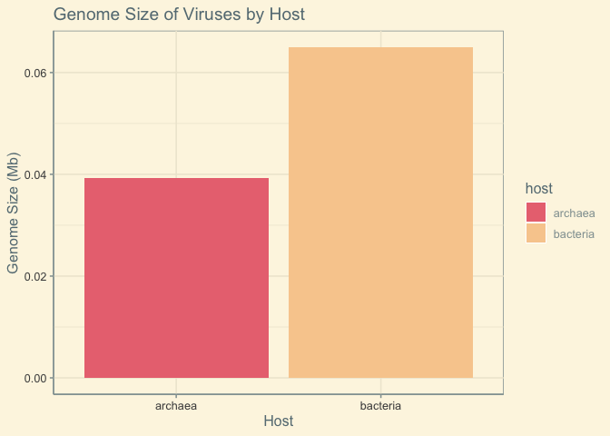
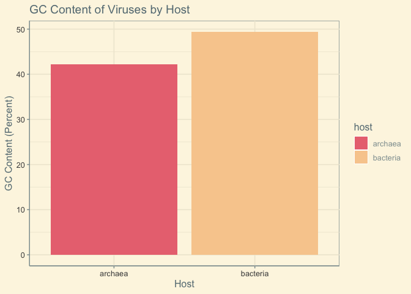
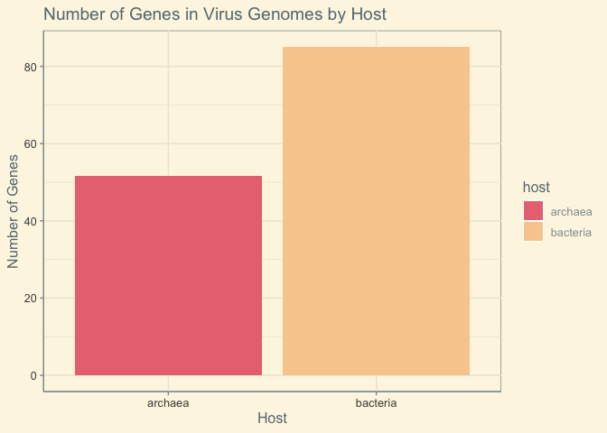
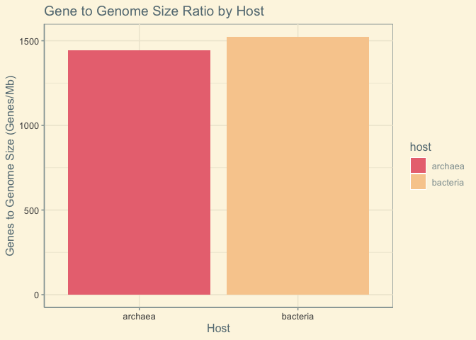

#importing data

```r
library(tidyverse)
```

```
## ── Attaching packages ─────────────────────────────────────── tidyverse 1.3.0 ──
```

```
## ✓ ggplot2 3.3.3     ✓ purrr   0.3.4
## ✓ tibble  3.1.0     ✓ dplyr   1.0.5
## ✓ tidyr   1.1.3     ✓ stringr 1.4.0
## ✓ readr   1.4.0     ✓ forcats 0.5.1
```

```
## ── Conflicts ────────────────────────────────────────── tidyverse_conflicts() ──
## x dplyr::filter() masks stats::filter()
## x dplyr::lag()    masks stats::lag()
```

```r
library(janitor)
```

```
## 
## Attaching package: 'janitor'
```

```
## The following objects are masked from 'package:stats':
## 
##     chisq.test, fisher.test
```

```r
library(ggthemes)
library(paletteer)
library(ggplot2)
library(RColorBrewer)
```

#setting up aesthetics for later

```r
colors<- LaCroixColoR::lacroix_palette("Pamplemousse", type = "discrete")
```

#importing data

```r
viruses <- readr::read_csv("data/viruses.csv") %>% clean_names()
```

```
## 
## ── Column specification ────────────────────────────────────────────────────────
## cols(
##   `Organism Name` = col_character(),
##   `Organism Groups` = col_character(),
##   BioSample = col_logical(),
##   BioProject = col_character(),
##   Assembly = col_character(),
##   Level = col_character(),
##   `Size(Mb)` = col_double(),
##   `GC%` = col_double(),
##   Host = col_character(),
##   CDS = col_double(),
##   Neighbors = col_double(),
##   `Release Date` = col_datetime(format = ""),
##   `GenBank FTP` = col_character(),
##   `RefSeq FTP` = col_character(),
##   Genes = col_double(),
##   Scaffolds = col_double()
## )
```

```
## Warning: 344 parsing failures.
##  row       col           expected       actual               file
## 1438 BioSample 1/0/T/F/TRUE/FALSE SAMN02981359 'data/viruses.csv'
## 4401 BioSample 1/0/T/F/TRUE/FALSE SAMN02981224 'data/viruses.csv'
## 8940 BioSample 1/0/T/F/TRUE/FALSE SAMN01137200 'data/viruses.csv'
## 8941 BioSample 1/0/T/F/TRUE/FALSE SAMN01137212 'data/viruses.csv'
## 8944 BioSample 1/0/T/F/TRUE/FALSE SAMN01137140 'data/viruses.csv'
## .... ......... .................. ............ ..................
## See problems(...) for more details.
```

#cleaning data

```r
viruses <- viruses %>% 
  filter(level == "Complete") %>% 
  select(organism_name, organism_groups, level, size_mb, gc_percent, host, genes)
```


```r
viruses<-viruses %>% 
  separate(organism_groups, into = c("domain", "group", "family"),sep=";")
```

#glimpse of data

```r
glimpse(viruses)
```

```
## Rows: 32,211
## Columns: 9
## $ organism_name <chr> "White spot syndrome virus", "Posavirus sp.", "Hepatitis…
## $ domain        <chr> "Viruses", "Viruses", "Viruses", "Viruses", "Viruses", "…
## $ group         <chr> "Other", "unclassified viruses", "Other", "Other", "uncl…
## $ family        <chr> "Nimaviridae", "unclassified", "Hepeviridae", "Marnaviri…
## $ level         <chr> "Complete", "Complete", "Complete", "Complete", "Complet…
## $ size_mb       <dbl> 0.309286, 0.009570, 0.007176, 0.008587, 0.018098, 0.0044…
## $ gc_percent    <dbl> 40.9000, 32.8000, 57.9000, 46.9000, 47.2000, 51.7000, 42…
## $ host          <chr> "invertebrates", "vertebrates", "human,vertebrates", NA,…
## $ genes         <dbl> 177, 1, 3, 1, 25, 3, 3, 3, 3, 75, 265, 51, 7, 1, 7, 10, …
```

#comparing viruses with bacterial vs archaeal hosts    
#bacteria: larger genome size, more genes, higher gc content    
#similar gene to genome size ratio    

```r
arch_bact <- viruses %>% 
  filter(host == "archaea"|host == "bacteria")
```


```r
data <- arch_bact %>% 
  group_by(host) %>% 
  summarize(size = mean(size_mb, na.rm = T),
            gc = mean(gc_percent, na.rm = T),
            gene = mean(genes, na.rm = T))
```


```r
data %>% 
  ggplot(aes(x=host, y=size, fill=host))+
  geom_col()+
  theme_solarized()+
  scale_fill_manual(values=colors)+
  labs(title = "Genome Size of Viruses by Host",
       x="Host",
       y="Genome Size (Mb)")
```

<!-- -->


```r
data %>% 
  ggplot(aes(x=host, y=gc, fill=host))+
  geom_col()+
  theme_solarized()+
  scale_fill_manual(values=colors)+
  labs(title = "GC Content of Viruses by Host",
       x="Host",
       y="GC Content (Percent)")
```

<!-- -->


```r
data %>% 
  ggplot(aes(x=host, y=gene, fill=host))+
  geom_col()+
  theme_solarized()+
  scale_fill_manual(values=colors)+
  labs(title = "Number of Genes in Virus Genomes by Host",
       x="Host",
       y="Number of Genes")
```

<!-- -->


```r
arch_bact %>% 
  filter(genes != 0) %>% 
  mutate(gene_mb_ratio = genes/size_mb) %>% 
  group_by(host) %>% 
  summarize(gene_content = mean(gene_mb_ratio, na.rm = T)) %>%
  ggplot(aes(x=host, y=gene_content, fill=host))+
  geom_col()+
  theme_solarized()+
  scale_fill_manual(values=colors)+
  labs(title = "Gene to Genome Size Ratio by Host",
       x="Host",
       y="Genes to Genome Size (Genes/Mb)")
```

<!-- -->
 
